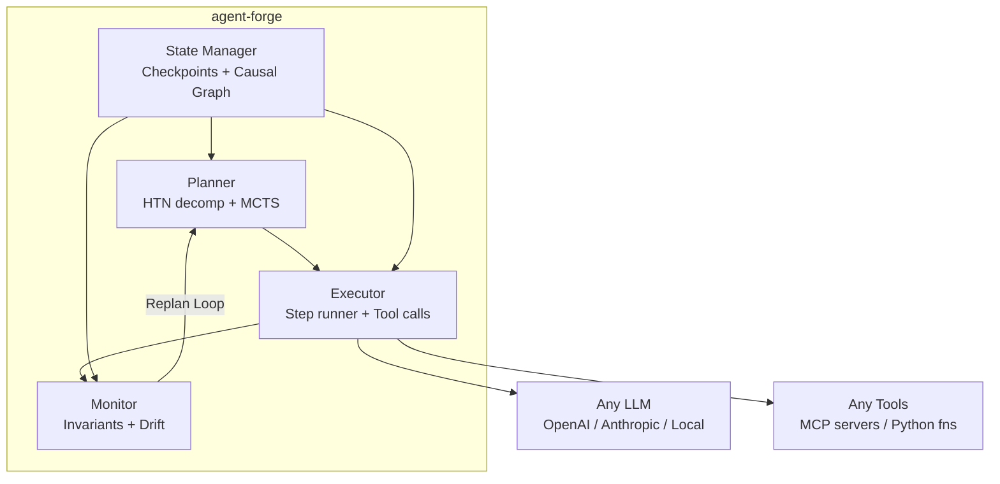

# agent-forge

[](https://www.python.org/downloads/)
[](LICENSE)
[](https://github.com/sushaan-k/agent-forge/actions)

**A long-horizon planning engine for LLM agents.**

`agent-forge` separates planning from generation. Instead of asking the model to
improvise an entire multi-step workflow in one shot, it decomposes goals,
scores candidate plans, executes with checkpoints, and replans when reality
diverges from the original plan.

---

## At a Glance

- **HTN decomposition** for turning a high-level goal into explicit subtask trees
- **Search-backed planning** with `greedy`, `beam`, and `mcts` strategies
- **Execution monitoring** for postconditions, invariants, and state drift
- **Checkpointed backtracking** to rewind only the affected parts of a plan
- **Model and tool agnostic** integration layer for LLMs, MCP tools, and Python callables

## The Problem

Current LLM agents are fundamentally broken at planning. Research ([arXiv:2601.22311](https://arxiv.org/abs/2601.22311)) proves that **reasoning does not equal planning** -- models with strong chain-of-thought reasoning fail catastrophically on long-horizon tasks due to "early myopic commitment." If an agent is 85% accurate per step, a 10-step workflow succeeds only ~20% of the time.

Every major agent framework (LangGraph, CrewAI, Anthropic's Agent SDK) delegates planning to the LLM itself. Nobody has built a dedicated planning layer.

## The Solution

`agent-forge` is a standalone planning engine that wraps any LLM agent and provides:

- **HTN decomposition** -- breaks high-level goals into validated subtask trees
- **MCTS plan selection** -- evaluates candidate plans via Monte Carlo Tree Search
- **Execution monitoring** -- checks postconditions, invariants, and state drift after every step
- **Backtracking with causal reasoning** -- rewinds to the right checkpoint and invalidates only the affected downstream steps

## Quick Start

```bash
pip install agent-forge
```

Minimal example:

```python
import asyncio
from agent_forge import Planner, Agent, Goal

goal = Goal(
    description="Research and write a market analysis report",
    success_criteria=["Report has 5+ sources", "All claims cited"],
    max_steps=50,
    invariants=["Never fabricate data"],
)

agent = Agent(model="claude-sonnet-4-6", tools=[])
planner = Planner(agent=agent, search_strategy="mcts")
result = asyncio.run(planner.execute(goal))
print(result.success, result.steps_completed)
```

When you already have an agent stack, `agent-forge` is intended to sit above it
as the planning and monitoring layer rather than replace your tool runtime.

## Architecture



### Core Components

| Component | Role |
|---|---|
| **Planner** | Decomposes goals into subtask trees (HTN), selects best plan via MCTS/beam/greedy |
| **Executor** | Runs plan steps sequentially, invokes tools or LLM, applies state changes |
| **Monitor** | Checks postconditions, global invariants, and state drift after each step |
| **BacktrackEngine** | Rewinds to checkpoints, invalidates causally-dependent steps |
| **StateManager** | Versioned world state, checkpoint/rollback, causal dependency graph |

## API Reference

### Goal

```python
from agent_forge import Goal

goal = Goal(
    description="Your high-level objective",
    success_criteria=["Condition 1", "Condition 2"],
    max_steps=100,
    invariants=["Safety constraint"],
    priority=1,
    metadata={"project": "example"},
)
```

### Agent

```python
from agent_forge import Agent
from agent_forge.tools import FunctionTool

def search_web(query: str) -> str:
    """Search the web for information."""
    return f"Results for: {query}"

agent = Agent(
    model="claude-sonnet-4-6",  # or "gpt-4o", or a BaseModel instance
    tools=[search_web],         # raw callables are auto-wrapped
    system_prompt="You are a research assistant.",
)
```

### Planner

```python
from agent_forge import Planner

planner = Planner(
    agent=agent,
    search_strategy="mcts",     # "greedy", "mcts", or "beam"
    max_backtrack_depth=5,
    checkpoint_interval=3,
    rollout_model=None,          # cheaper model for MCTS rollouts
    num_simulations=50,
)

result = await planner.execute(goal)

print(result.success)           # bool
print(result.steps_completed)   # int
print(result.steps_total)       # int
print(result.verdicts)          # list of MonitorVerdict
print(result.final_state)       # dict
```

### MCP Tools

```python
from agent_forge.tools import MCPTool

# Discover tools from an MCP server
tools = await MCPTool.discover("http://localhost:3000")

# Or create one directly
tool = MCPTool(
    server_url="http://localhost:3000",
    tool_name="search",
    description="Search the knowledge base",
    input_schema={"type": "object", "properties": {"query": {"type": "string"}}},
)
result = await tool.execute(query="market trends 2026")
```

### Custom Model Backends

```python
from agent_forge.models.base import BaseModel, ModelResponse

class MyLocalModel(BaseModel):
    async def generate(self, messages, tools=None, **kwargs):
        # Call your local model here
        return ModelResponse(content="response text", model="local-7b")

agent = Agent(model=MyLocalModel(model_name="local-7b"))
```

## Search Strategies

| Strategy | Use Case | Compute |
|---|---|---|
| `greedy` | Fast, single-plan execution. Good for simple tasks. | Low |
| `beam` | Scores multiple plans independently. Middle ground. | Medium |
| `mcts` | Full MCTS with rollouts. Best for complex, long-horizon tasks. | High |

## Where It Fits

`agent-forge` is a good fit when:

- the task is long enough that early mistakes cascade
- you need explicit success criteria and invariants
- you want a planner that can explain why it backtracked
- you already have tools and models, but not a robust planning layer

## Key Design Decisions

- **Model-agnostic**: Works with any LLM via standard API. The planner constrains and guides the LLM; it does not replace it.
- **MCP-native**: Tool calls go through MCP, so any MCP server is automatically available.
- **Separation of concerns**: LLM handles creativity/reasoning. Planner handles structure/validation. Monitor handles safety/correctness.
- **Lightweight**: Not a framework -- a library. `pip install agent-forge`, wrap your existing agent, done.

## Examples

See the [`examples/`](examples/) directory:

- **`research_agent.py`** -- Research and write a report with source verification
- **`coding_agent.py`** -- Multi-file code generation with test validation
- **`web_agent.py`** -- Web navigation with checkpoint-based recovery

## Demo

Run the offline walkthrough with:

```bash
uv run python examples/demo.py
```

For longer-horizon coding, research, and web workflows, see `examples/`.

## Development

```bash
git clone https://github.com/sushaan-k/agent-forge.git
cd agent-forge
pip install -e ".[dev]"

# Run tests
pytest

# Lint
ruff check src/ tests/

# Type check
mypy src/agent_forge/
```

## Research References

- [Why Reasoning Fails to Plan](https://arxiv.org/abs/2601.22311) (arXiv, Jan 2026)
- [DeepPlanning: Benchmarking Long-Horizon Agentic Planning](https://arxiv.org/abs/2601.18137) (arXiv, Jan 2026)
- Hierarchical Task Network Planning with LLMs (NeurIPS 2025 Workshop)
- Monte Carlo Tree Search for Language Model Decoding (ICML 2025)

## Contributing

Contributions are welcome. Please open an issue first to discuss what you want to change.

1. Fork the repository
2. Create a feature branch (`git checkout -b feature/your-feature`)
3. Make your changes with tests
4. Run `pytest`, `ruff check`, and `mypy` before submitting
5. Open a pull request

## License

[MIT](LICENSE)
